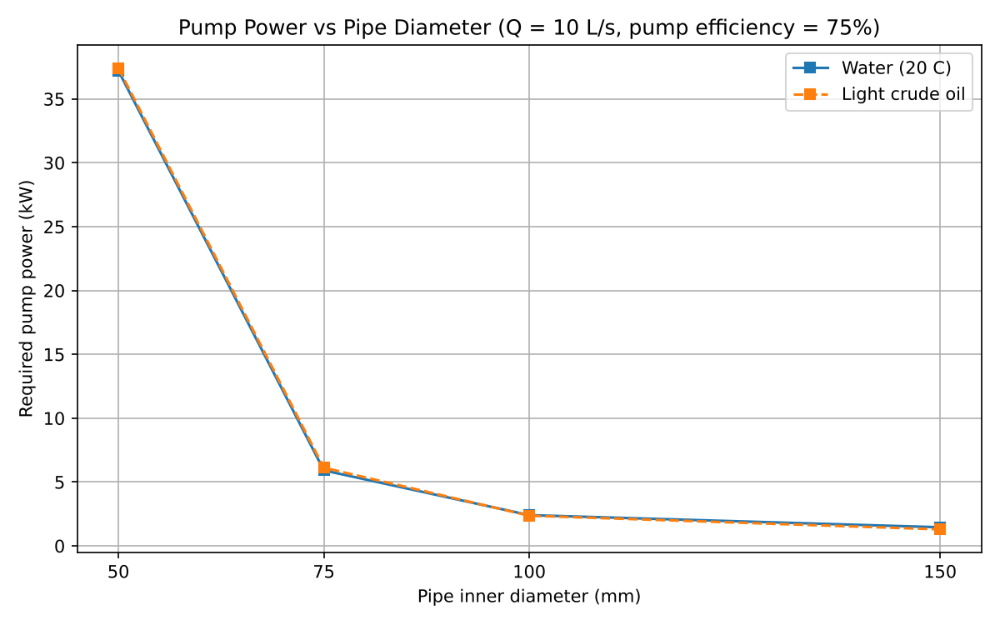
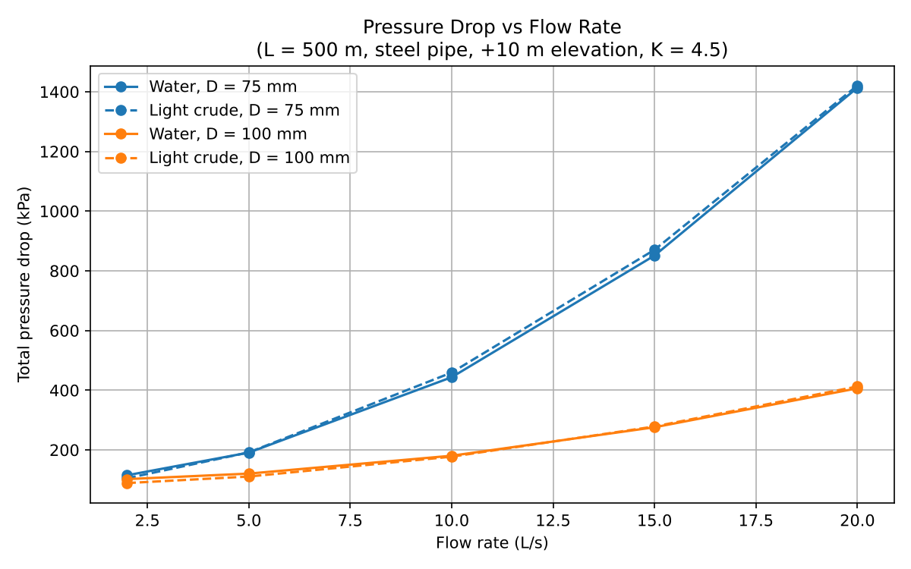

# Pipe Flow & Pump Sizing Calculator


A Python tool that calculates **pressure drop, head loss and required pump power** for single-phase flow in a pipe. It is used here to compare pipe sizes for **water and light crude oil**.

It applies the **Darcy-Weisbach** equation with an iterative **Colebrook-White** friction factor solver. It also includes fitting (minor) losses and elevation change, and it is validated against hand calculations before any results are trusted.



## Key findings

All results use a 500 m commercial steel pipe with a 10 m rise, fittings totalling K = 4.5, and a 75% efficient pump.

| Pipe diameter | Water: pressure drop | Water: pump power | Light crude: pump power |
|---|---|---|---|
| 50 mm | 2,791 kPa | 37.2 kW | 37.4 kW |
| 75 mm | 444 kPa | 5.9 kW | 6.1 kW |
| **100 mm** | **180 kPa** | **2.4 kW** | **2.4 kW** |
| 150 mm | 109 kPa | 1.5 kW | 1.3 kW |

*All values at a flow rate of 10 L/s.*

- **Upsizing from 75 mm to 100 mm cuts required pump power by 59%.**
- **Gains drop off above 100 mm.** Moving to 150 mm saves only about 1 kW more, while larger pipe costs more to buy and install. For this layout, 100 mm is the practical choice.
- **Light crude behaves almost like water here.** Its viscosity is about 5 times higher, but the flow stays turbulent, where pipe roughness matters more than viscosity. The exception is the 150 mm pipe at 2 L/s, where crude enters the transitional range (Re ≈ 2,900); the tool flags this case.



## Method

| Quantity | Equation |
|---|---|
| Velocity | V = Q / (πD²/4) |
| Reynolds number | Re = ρVD / μ  (laminar < 2300, transitional 2300–4000, turbulent > 4000) |
| Friction factor, laminar | f = 64 / Re |
| Friction factor, turbulent | Colebrook-White, solved by fixed-point iteration from a Swamee-Jain starting guess |
| Major loss | ΔP = f (L/D) ρV²/2  (Darcy-Weisbach) |
| Minor loss | ΔP = K ρV²/2 |
| Elevation | ΔP = ρ g Δz |
| Pump power | P = Q ΔP_total / η |

Water properties come from [CoolProp](http://www.coolprop.org/). If CoolProp is not installed, the tool falls back to standard correlations (Kell density, Vogel viscosity). Light crude uses typical values (ρ = 850 kg/m³, μ = 0.005 Pa·s), which you can replace with lab data.

## Validation

| Check | Expected | Result |
|---|---|---|
| Laminar friction factor at Re = 1000 | 0.0640 | 0.0640 ✔ |
| Colebrook vs Swamee-Jain (28 cases, Re 5×10³ to 10⁷) | within ~3% | max 2.83% ✔ |
| Hand calculation: water 20 °C, 50 mm steel, 100 m, 5 L/s | ≈ 138 kPa | 138.2 kPa ✔ |

The full hand calculation is in [`docs/hand_calculation.md`](docs/hand_calculation.md). The unit tests in [`tests/`](tests/) run automatically on every push through GitHub Actions.

## Getting started

```bash
git clone https://github.com/lucascerriku/pipe-flow-pump-sizing-calculator.git
cd pipe-flow-pump-sizing-calculator
pip install -r requirements.txt

python pipe_flow_calculator.py                 # validation + 40 scenarios + charts
python pipe_flow_calculator.py --interactive   # also enter your own custom case
pytest                                         # run the unit tests
```

The outputs are written to `results/`: `scenario_results.csv` (40 scenarios: 2 fluids × 4 diameters × 5 flow rates) and the two charts.

## Project structure

```
pipe-flow-pump-sizing-calculator/
├── pipe_flow_calculator.py      # calculator, validation, scenario study, charts
├── requirements.txt
├── tests/
│   └── test_pipe_flow.py        # 7 unit tests
├── results/                     # generated CSV and charts
├── docs/
│   ├── hand_calculation.md      # worked validation example
│   └── Project_Plan_Pipe_Flow_Calculator.xlsx
└── .github/workflows/tests.yml  # runs tests on every push
```

## Project management

This project was run as a formal 4-week project (Oct. to Nov. 2026). The plan is in [`docs/Project_Plan_Pipe_Flow_Calculator.xlsx`](docs/Project_Plan_Pipe_Flow_Calculator.xlsx) and includes:
- **Project charter:** objective, in-scope and out-of-scope items, deliverables, success criteria, assumptions.
- **Gantt schedule:** 11 tasks across 6 phases (initiation, research, development, testing, analysis, closeout).
- **Risk register:** 7 risks scored by likelihood and impact, each with a mitigation. The top risk, unit-conversion error, is mitigated by using SI units throughout and by validating against hand calculations.
- **Effort budget:** 40 planned hours tracked against actual hours.

## Assumptions and limitations

- Steady, incompressible, fully developed, single-phase flow.
- The transitional range (2300 < Re < 4000) uses Colebrook as a conservative estimate and is flagged in the output.
- Not modelled: multiphase flow, pipe networks, transients (water hammer), heat transfer, or temperature-dependent oil viscosity.

## Future work

- Match results against a real pump curve to find the operating point.
- Support pipe networks (series and parallel branches).
- Model oil viscosity as a function of temperature.

## Author

**Lucas Cerriku**, Mechanical Engineering, Lassonde School of Engineering, York University
[LinkedIn](https://www.linkedin.com/in/lucas-cerriku-57254830a/)

Licensed under the [MIT License](LICENSE).
